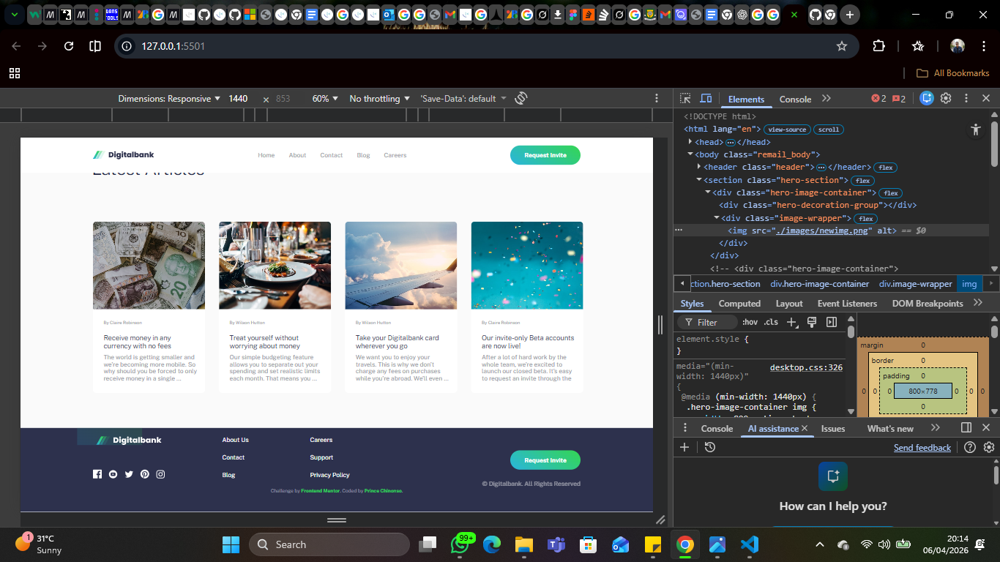

- Digitalbank Responsive Landing Page

- Developed by Prince Chinonso
- A pixel-perfect, high-performance landing page built with a Mobile-First strategy. This project demonstrates advanced CSS positioning, responsive architecture (375px to 1440px), and clean JavaScript functionality.

## Table of contents

- [Overview](#overview)
  - [The challenge](#the-challenge)
  - [Screenshot](#screenshot)
  - [Links](#links)
- [My process](#my-process)
  - [Built with](#built-with)
  - [What I learned](#what-i-learned)
  - [Continued development](#continued-development)
  - [Useful resources](#useful-resources)
- [Author](#author)
- [Acknowledgments](#acknowledgments)

## Overview

### The challenge

- The Technical Journey: Challenges & Solutions
1. The "Invisible" Hamburger Icon (Mobile)
The Challenge: The mobile menu icon wasn't appearing even though the code was present. The bars were stacking on top of each other or lacking a background color.
The Resolution: I transitioned from a broken image tag to a custom-built CSS icon. By using position: relative on the button and position: absolute on three div bars with specific top offsets, I created a visible, scalable icon.

The Proof:
css
.hamburger-bar {
  position: absolute;
  width: 24px;
  height: 1px;
  background-color: #2D314D;
}

.bar-2 { top: 5px; } 
.bar-3 { top: 10px; } 

2. The Header (Desktop 1440px)
The Challenge: When switching to Desktop, the Logo, Links, and Button were all huddled together in a 327px box in the center, the links were hidden behind the button.
The Resolution: I identified a Specificity Bug where the mobile class was overriding the desktop element. I fixed this by using .header-content with a max-width: 1110px and justify-content: space-between to force the items to the far edges of the 1440px bar.
The Proof:
css
.header-content {
  display: flex;
  justify-content: space-between;
  width: 100%;
  max-width: 1110px;
}

3. The Hero Mockups: desktop
The Challenge: The phone mockups were being cut off at the bottom or the side. They refused to overlap the background pattern and the "Features" section below.
The Resolution: I tried the parent container by using overflow: visible and used negative positioning to pull the phones out of the hero section. This allowed the 778px tall image to bleed into the next section perfectly.

The Proof:
css
.image-wrapper {
  width: 800px;
  height: 778px;
  position: absolute !important;
  right: -150px; 
  top: -120px;
}

.hero-section { overflow: visible !important; } /* Stopped the clipping */
Use code with caution.

4. The Attribution Wrapping Bug
The Challenge: On mobile screens, "Coded by Prince Chinonso" was breaking into two lines, making the footer look unprofessional.
The Resolution: I implemented the white-space property to lock the text onto a single horizontal line regardless of screen width.

The Proof:
css
.attribution {
  font-size: 11px;
  white-space: nowrap; 
  text-align: center;
}

Users should be able to:

- View the optimal layout for the site depending on their device's screen size: Tablets, Mobile & Desktop
- See hover states for all interactive elements on the page

### Screenshot

### Links

- Solution URL: (https://github.com/Powerful-2/Digitalbank-Landing-Page)
- Live Site URL: (https://powerful-2.github.io/Digitalbank-Landing-Page/)

## My process

### Built with
- Built with
- Semantic HTML5 markup
- CSS Custom Properties (Variables)
- Flexbox for complex alignment
- Mobile-first workflow
- Vanilla JavaScript for menu toggling
- Media Queries for 1440px Desktop optimization

### Useful resources

- Frontend Mentor - The platform that provided the professional design mockups and project brief for this Digitalbank challenge.
- A Complete Guide to Flexbox (CSS-Tricks) - This was my go-to reference for positioning the bank's feature cards and navigation items.
- BEM Methodology Documentation - This helped me maintain a clean and scalable CSS structure by using the Block-Element-Modifier naming convention.
- MDN Web Docs: Flexbox - An essential resource for understanding how the flex container and items interact, especially for mobile responsiveness.
- Google Fonts - Used to import the specific typography required by the project's style guide.
- Can I Use - I used this to double-check browser compatibility for newer CSS properties like gap in Flexbox

## Author

- Website - (https://powerful-2.github.io/Digitalbank-Landing-Page/)
- Frontend Mentor - [@yourusername](https://www.frontendmentor.io/profile/Powerful-2)
- Twitter - (https://x.com/Koolprince0)

## Acknowledgments

I want to thank Tobi for the moral support and also showing me how to seperate my media queries instead of being in one file: style.css.

He taught me to separate my CSS by creating a file named tab.css and desktop.css.
