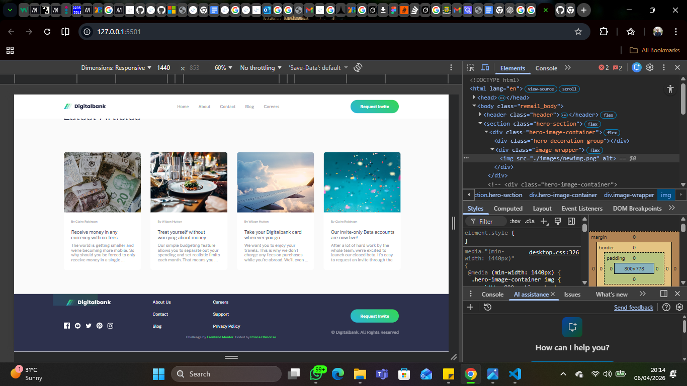

- Digitalbank Responsive Landing Page

- Developed by Prince Chinonso
- A pixel-perfect, high-performance landing page built with a Mobile-First strategy. This project demonstrates advanced CSS positioning, responsive architecture (375px to 1440px), and clean JavaScript functionality.

## Table of contents

- [Overview](#overview)
  - [The challenge](#the-challenge)
  - [Screenshot](#screenshot)
  - [Links](#links)
- [My process](#my-process)
  - [Built with](#built-with)
  - [What I learned](#what-i-learned)
  - [Continued development](#continued-development)
  - [Useful resources](#useful-resources)
- [Author](#author)
- [Acknowledgments](#acknowledgments)


## Overview

### The challenge

- The Technical Journey: Challenges & Solutions
1. The "Invisible" Hamburger Icon (Mobile)
The Challenge: The mobile menu icon wasn't appearing even though the code was present. The bars were stacking on top of each other or lacking a background color.
The Resolution: I transitioned from a broken image tag to a custom-built CSS icon. By using position: relative on the button and position: absolute on three div bars with specific top offsets, I created a visible, scalable icon.

The Proof:
css
.hamburger-bar {
  position: absolute;
  width: 24px;
  height: 1px;
  background-color: #2D314D;
}

.bar-2 { top: 5px; } 
.bar-3 { top: 10px; } 

2. The Header (Desktop 1440px)
The Challenge: When switching to Desktop, the Logo, Links, and Button were all huddled together in a 327px box in the center, the links were hidden behind the button.
The Resolution: I identified a Specificity Bug where the mobile class was overriding the desktop element. I fixed this by using .header-content with a max-width: 1110px and justify-content: space-between to force the items to the far edges of the 1440px bar.
The Proof:
css
.header-content {
  display: flex;
  justify-content: space-between;
  width: 100%;
  max-width: 1110px;
}

3. The Hero Mockups: desktop
The Challenge: The phone mockups were being cut off at the bottom or the side. They refused to overlap the background pattern and the "Features" section below.
The Resolution: I tried the parent container by using overflow: visible and used negative positioning to pull the phones out of the hero section. This allowed the 778px tall image to bleed into the next section perfectly.

The Proof:
css
.image-wrapper {
  width: 800px;
  height: 778px;
  position: absolute !important;
  right: -150px; 
  top: -120px;
}

.hero-section { overflow: visible !important; } /* Stopped the clipping */
Use code with caution.

4. The Attribution Wrapping Bug
The Challenge: On mobile screens, "Coded by Prince Chinonso" was breaking into two lines, making the footer look unprofessional.
The Resolution: I implemented the white-space property to lock the text onto a single horizontal line regardless of screen width.

The Proof:
css
.attribution {
  font-size: 11px;
  white-space: nowrap; 
  text-align: center;
}

Users should be able to:

- View the optimal layout for the site depending on their device's screen size: Tablets, Mobile & Desktop
- See hover states for all interactive elements on the page

# 🏦 Digitalbank - Enterprise High-Fidelity Landing Page Portal

A comprehensive, multi-page web application engineered to model a next-generation neo-banking platform. This system refactors a standard frontend challenge into a fully production-ready interface by implementing a mobile-first responsive architecture, defensive JavaScript logic layers, complete client-side asynchronous form automation, and an advanced Search Engine Optimization (SEO) structural suite.

🌐 Production Live Link: [Launch Digitalbank Web Portal](https://powerful-2.github.io/Digitalbank-Landing-Page/)  

👤 Author Profile: Prince Chinonso (Frontend Software Engineer)

---

## 🛠️ THE_SYSTEM_STACK_AND_CONSTRAINTS (SCREAMING_SNAKE_CASE)

To maximize performance metrics, lower page payload sizes, and guarantee lightning-fast load times, this project rejects heavy frameworks in favor of a optimized native structural pipeline:

* MARKUP_LANGUAGE: Native semantic HTML5 for strict structural integrity and screen-reader web accessibility.
* STYLE_ENGINE: Modular Vanilla CSS3 utilizing custom root variable parameters and isolated cross-file breakpoint layers.
* LOGIC_ENGINE: Modern asynchronous Vanilla JavaScript (ECMAScript 2026+) running strict DOM API event manipulation.
* AUTOMATION_API: External EmailJS SDK compiler for secure client-to-server messaging protocols without backend overhead.
* INDEX_PROTOCOL: Structured XML Sitemap Protocol 0.90 mapped to custom Robots Exclusion Standard directory rules.

---

## 📐 Component Architecture & Page Layout Blueprint (PascalCase)

The user interface layer completely isolates style tracking across separate cascading files to eliminate code fragmentation and allow easy maintenance.

### 📋 Core Platform Directory Mapping
* `index.html` ➡️ Primary conversion funnel featuring responsive value proposition matrices and latest article grid arrays.
* `about.html` ➡️ Organizational overview panel utilizing structured main wrapper layers to isolate text flow.
* `careers.html` ➡️ Interactive recruitment job board optimized with centered variable dashboard cards.
* `blog.html` ➡️ Editorial content index running a real-time keyup title search engine filter.
* `contact.html` ➡️ Secure communication portal connected to an automated asynchronous email distribution pipeline.
* `login.html` ➡️ Protected authentication gateway equipped with demo credential evaluation frameworks.
* `signup.html` ➡️ New account registration view complete with defensive length validation checks.

### 🗂️ Stylesheet Layout Progression Lifecycle
* `style.css` ➡️ Handles core root design system definitions, global text scale constraints, and base phone viewports up to 767px.
* `tablets.css` ➡️ Automatically injects flex-wrap properties and content-squeezing containers between 768px and 1439px.
* `desktop.css` ➡️ Executes premium widescreen alignment grids and fluid horizontal expansions from 1440px upward.

---

## Production Layout Bugs Resolved & Code Refactors (camelCase)

### 🚨 1. Eradicating Fixed-Header Content Layout Collapse
* The Bug: Because the header container relies on a fixed document layer (`position: fixed; height: 64px;`), it was pulled from the browser's standard layout tree. This caused subpage contents across `about.html` and `careers.html` to collapse beneath the navbar layer, turning headings invisible.
* The Code Refactor: Every subpage was wrapped in a `<main class="page-content-wrapper">` structural tag. We then engineered a permanent top-margin padding barrier locked strictly to pixel measurements inside `style.css`:
  ```css
  .page-content-wrapper {
    padding-top: 84px !important; /* Enforces 20px of explicit breathing room below the fixed 64px bar */
    padding-bottom: 48px;
    padding-left: 24px;
    padding-right: 24px;
    min-height: calc(100vh - 64px);
    box-sizing: border-box;
  }
  ```

### 2. Standardizing the Typography Scale & Eliminating Script Creep
* The Bug: Diverse external decorative script links (such as `Fredericka the Great`) leaked into subpage layout files. This metadata noise, paired with random inline styles, caused heading modules to warp across page tabs, breaking banking brand rules.
* The Code Refactor: Removed all conflicting script wrappers. Unified the text engine to load the crisp **Public Sans** font family globally, forcing the compiler to respect strict structural weights:
  ```css
  body, h1, h2, h3, h4, p, a, button, span, li {
    font-family: "Public Sans", sans-serif !important;
  }
  h1 { font-size: 40px; line-height: 48px; font-weight: 700; color: var(--primary-dark-blue); }
  h2 { font-size: 32px; line-height: 38px; font-weight: 400; color: var(--primary-dark-blue); }
  h3 { font-size: 20px; line-height: 24px; font-weight: 600; color: var(--primary-dark-blue); }
  ```

### 3. Upgrading the Careers List Dashboard Component
* The Bug: Job board link boxes inside `careers.html` recycled global header styles (`.request-invite-btn`), causing buttons to stretch unevenly based on layout row lengths. Furthermore, the cards expanded across the entire browser pane on wide desktops, damaging visual hierarchy.
* The Code Refactor: Isolated the cards into an independent component system (`.job-card` and `.job-apply-btn`). We capped layout maximum dimensions using auto-margins and updated structural layouts from horizontal stretches to elegant, centered columns:
  ```css
  .careers.section.container {
    max-width: 580px; /* Restricts component tracking footprint */
    margin: 0 auto; /* Perfectly centers panel blocks on the screen */
  }
  .job-card {
    display: flex;
    flex-direction: column;
    align-items: center; /* Drops text and CTA modules into the center line */
    text-align: center;
    background: var(--white);
    padding: 32px;
    border-radius: 8px;
    box-shadow: 0px 4px 12px rgba(0, 0, 0, 0.05);
  }

---

## Automation Pipelines & System Optimization (kebab-case)

* asynchronous-loading-states: To resolve browser layout freezes during external EmailJS API handshakes, the contact form listener was upgraded to instantly update button values to `"Sending..."` while locking input interactivity. This blocks multiple submission loops and stabilizes system states.
* defensive-dom-validation: Variable extractions inside `script.js` are wrapped in short-circuit verification blocks (`if (targetElement)`) to stop runtime code execution crashes. If a component (like the search engine) is missing on pages like `login.html`, the script bypasses it safely rather than throwing an `Uncaught TypeError` that freezes the navbar menu toggle.
* metadata-social-injection: Every HTML subpage contains complete canonical tracking declarations and specific Open Graph (`og:`) properties, generating high-fidelity preview cards when links are shared on LinkedIn, X, or Slack.
* automated-crawler-discovery: Built a compliant, absolute-pathed `sitemap.xml` listing paired with a custom `robots.txt` manifest file to direct web spiders directly to indexed assets while protecting server bandwidth.

---

## Mock Authentication Layer Details

The platform simulates a secure enterprise dashboard system. To check credential processing logic across `login.html` and `signup.html`, evaluate the application using these parameters:

* Demo Username Login: |john@gmail.com|
* Demo Security Password: |password123|

---

## Local Deployment Framework
1. Copy this project repository directory to your local development computer.
2. Launch your terminal environment, move into the directory root, and ensure your system configuration paths align.
3. Launch via your code editor's Live Server plugin (`http://127.0.0`).


### Screenshot





### Links

- Solution URL: (https://github.com/Powerful-2/Digitalbank-Landing-Page)
- Live Site URL: (https://powerful-2.github.io/Digitalbank-Landing-Page/)

## My process

### Built with
- Built with
- Semantic HTML5 markup
- CSS Custom Properties (Variables)
- Flexbox for complex alignment
- Mobile-first workflow
- Vanilla JavaScript for menu toggling
- Media Queries for 1440px Desktop optimization


### Useful resources

- Frontend Mentor - The platform that provided the professional design mockups and project brief for this Digitalbank challenge.
- A Complete Guide to Flexbox (CSS-Tricks) - This was my go-to reference for positioning the bank's feature cards and navigation items.
- BEM Methodology Documentation - This helped me maintain a clean and scalable CSS structure by using the Block-Element-Modifier naming convention.
- MDN Web Docs: Flexbox - An essential resource for understanding how the flex container and items interact, especially for mobile responsiveness.
- Google Fonts - Used to import the specific typography required by the project's style guide.
- Can I Use - I used this to double-check browser compatibility for newer CSS properties like gap in Flexbox


## Author

- Website - (https://powerful-2.github.io/Digitalbank-Landing-Page/)
- Frontend Mentor - (https://www.frontendmentor.io/profile/Powerful-2)
- Twitter - (https://x.com/Koolprince0)


## Acknowledgments

I want to thank Tobi for the moral support and also showing me how to seperate my media queries instead of being in one file: style.css.

He taught me to separate my CSS by creating a file named tab.css and desktop.css.
